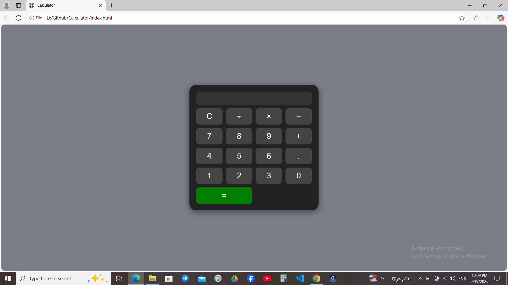

# Calculator Project

## Description
A simple web-based calculator layout built with HTML and CSS.  
It shows a calculator interface with buttons for basic arithmetic operations, but does not perform actual calculations yet.

## Features
- Calculator interface with buttons for addition (+), subtraction (-), multiplication (×), and division (÷)
- Clear (C) button for resetting input (UI only)
- Decimal point (.) button (UI only)
- Stylish modern interface with hover effects
- Responsive layout for different screen sizes

## Technologies Used
- HTML
- CSS

## How to Use
1. Open the `index.html` file in a web browser.
2. You can see the calculator layout and click buttons (UI only).

## Screenshot

## Author
Nahed Magdy

## License
This project is free to use for learning and personal purposes.
